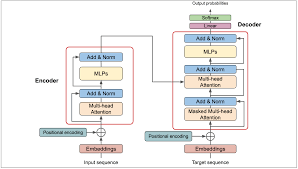
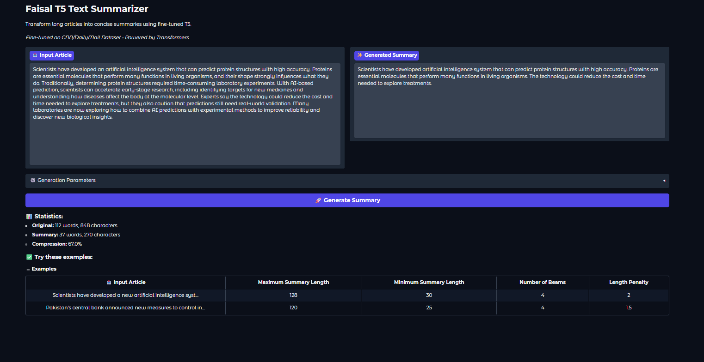
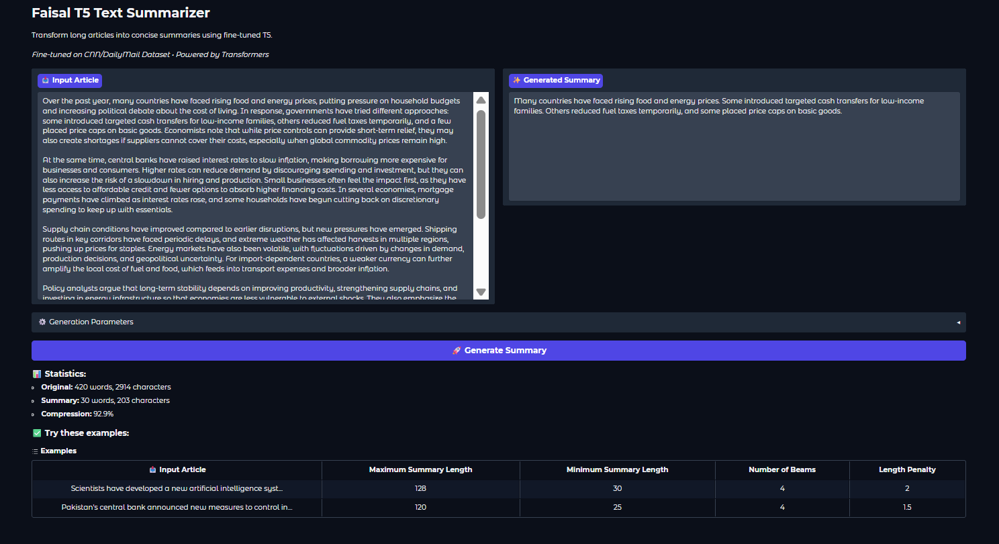
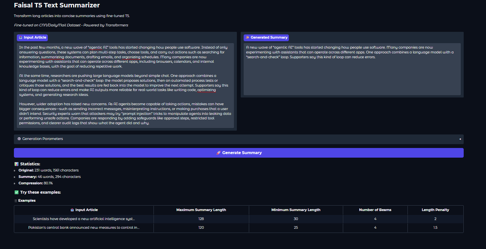
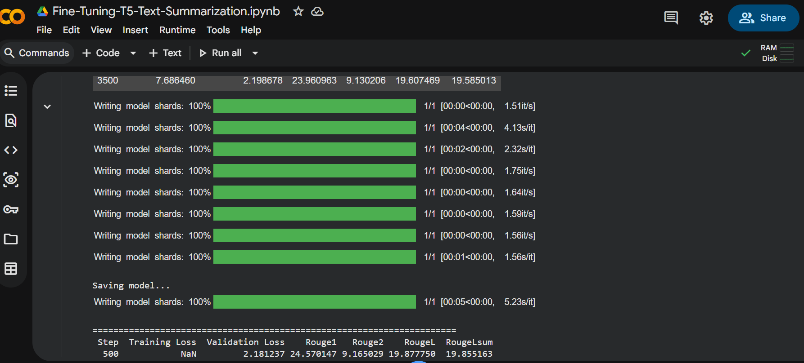
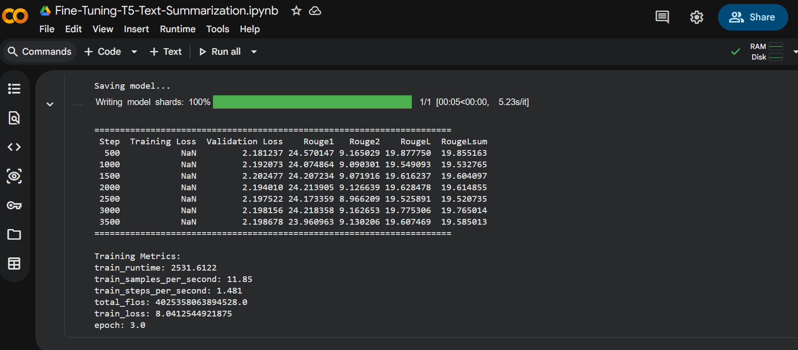

# 🧠 Fine-Tuning T5 Transformer for Text Summarization

**Project Type:** NLP | Deep Learning | Sequence-to-Sequence  

**Model:** T5-small (Text-to-Text Transfer Transformer)  

 **Framework:** Hugging Face Transformers  

 **Objective:** Abstractive text summarization using fine-tuned Transformer

---

## 🏁 Overview

This project demonstrates how to \*\*fine-tune the pre-trained T5 model\*\* (`t5-small`) for \*\*abstractive text summarization\*\* using the Hugging Face `transformers` and `datasets` libraries.  

It walks through every stage — from preprocessing to evaluation and deployment — for an end-to-end summarization system.

Unlike extractive summarization, where sentences are selected from the original text, **abstractive summarization** *generates new sentences* that capture the essence of the text.

---

## ⚙️ Core Idea: Text-to-Text Framework

The **T5 (Text-to-Text Transfer Transformer)** model, proposed by Google Research, treats every NLP task as a **text-to-text** problem:

| Task          | Input Format                                      | Output Format                 |
|---------------|---------------------------------------------------|-------------------------------|
| Translation   | `"translate English to German: Hello"`            | `"Hallo"`                     |
| Summarization | `"summarize: The article says ..."`               | `"The article discusses ..."` |
| QA            | `"question: Who invented AI? context: ..."`       | `"John McCarthy"`             |

This unified approach allows a single model architecture to handle diverse NLP tasks.

---

## 🧩 Project Features

- ✅ Fine-tunes `t5-small` on a summarization dataset  

- ✅ Implements preprocessing, tokenization, and data batching  

- ✅ Includes **ROUGE evaluation** for summary quality  

- ✅ Handles **training resumption, checkpoints, and saving**  

- ✅ Compatible with **Google Colab + Drive** for cloud training  

- ✅ Clean modular code with **configurable parameters** and **logging**

---

## 📁 Directory Structure

 **Note:** Keep your screenshots inside the `Images/` folder.
 
...
Fine-Tuning--T5-Transformer-for-Text-Summarization/
├── assets/
│   └── images/
│       ├── ChatGPT Image Nov 2, 2025, 10_02_31 PM.png
│       ├── 1.png
│       ├── 2.png
│       ├── 3.png
│       ├── a.png
│       ├── b.png
│       ├── c.png
│       └── tran.png
├── training_script.ipynb
├── .gitignore
└── README.md
...

---

## 🧠 Model Architecture

**T5 (Text-to-Text Transfer Transformer)** is based on the Transformer encoder-decoder structure.

- **Encoder:** Converts the input text into contextual embeddings  

- **Decoder:** Generates the target summary token by token  

- **Objective:** Minimize the cross-entropy loss between predicted and target summaries  

(Optional diagram)

---

## 🧮 Dataset Preparation

Any dataset containing pairs of *text → summary* can be used.  

The input data should contain at least two columns:

- `article` (or `text`) — source text to summarize  

- `highlights` (or `summary`) — reference summary  

Example (from CNN/DailyMail or custom dataset):

{

&nbsp; "article": "The T5 model was introduced by Google Research...",

&nbsp; "summary": "T5 is a transformer model treating all NLP tasks as text-to-text."

}

---

## 🧰 Installation \& Setup

Run the following in your Colab or local environment:

pip install transformers datasets evaluate sentencepiece accelerate

Mount Google Drive if using Colab:

from google.colab import drive

drive.mount('/content/drive')

---

## Configuration (config.py)

### class Config:

&nbsp;   MODEL_NAME = "t5-small"

&nbsp;   MAX_INPUT_LENGTH = 512

&nbsp;   MAX_TARGET_LENGTH = 150

&nbsp;   TRAIN_BATCH_SIZE = 8

&nbsp;   EVAL_BATCH_SIZE = 8

&nbsp;   LEARNING_RATE = 3e-4

&nbsp;   NUM_EPOCHS = 3

&nbsp;   OUTPUT_DIR = "/content/t5_summarizer"

&nbsp;   GRADIENT_ACCUMULATION_STEPS = 4

---

## 🧹 Data Preprocessing \& Tokenization

Each article-summary pair is preprocessed and tokenized:

def preprocess_function(examples):

&nbsp;   inputs = ["summarize: " + doc for doc in examples["article"]]

&nbsp;   model_inputs = tokenizer(inputs, max_length=512, truncation=True)

&nbsp;   labels = tokenizer(text_target=examples["summary"], max_length=150, truncation=True)

&nbsp;   model_inputs["labels"] = labels["input_ids"]

&nbsp;   return model_inputs

### Then processed using:

tokenized_train = dataset["train"].map(preprocess_function, batched=True)

tokenized_val = dataset["validation"].map(preprocess_function, batched=True)

---

## 🏋️‍♀️ Training Setup

training_args = TrainingArguments(

&nbsp;   output_dir=config.OUTPUT_DIR,

&nbsp;   evaluation_strategy="steps",

&nbsp;   save_strategy="steps",

&nbsp;   per_device_train_batch_size=config.TRAIN_BATCH_SIZE,

&nbsp;   per_device_eval_batch_size=config.EVAL_BATCH_SIZE,

&nbsp;   learning_rate=config.LEARNING_RATE,

&nbsp;   num_train_epochs=config.NUM_EPOCHS,

&nbsp;   predict_with_generate=True,

&nbsp;   logging_steps=500,

&nbsp;   save_steps=500,

&nbsp;   eval_steps=500,

&nbsp;   gradient_accumulation_steps=config.GRADIENT_ACCUMULATION_STEPS,

&nbsp;   report_to="none"

)

---

## 📏 Evaluation Metrics (ROUGE)

We use ROUGE (Recall-Oriented Understudy for Gisting Evaluation) — the standard summarization metric. It measures the overlap between model-generated and reference summaries.

rouge = evaluate.load("rouge")

def compute_metrics(eval_pred):

&nbsp;   predictions, labels = eval_pred

&nbsp;   decoded_preds = tokenizer.batch_decode(predictions, skip_special_tokens=True)

&nbsp;   labels = np.where(labels != -100, labels, tokenizer.pad_token_id)

&nbsp;   decoded_labels = tokenizer.batch_decode(labels, skip_special_tokens=True)

&nbsp;   result = rouge.compute(predictions=decoded_preds, references=decoded_labels, use_stemmer=True)

&nbsp;   return {k: v * 100 for k, v in result.items()}

---

## 🚀 Training the Model

trainer = Trainer(

&nbsp;   model=model,

&nbsp;   args=training_args,

&nbsp;   train_dataset=tokenized_train,

&nbsp;   eval_dataset=tokenized_val,

&nbsp;   tokenizer=tokenizer,

&nbsp;   compute_metrics=compute_metrics,

)

train_result = trainer.train()

trainer.save_model(config.OUTPUT_DIR)

tokenizer.save_pretrained(config.OUTPUT_DIR)

---

### Sample Output During Training

 (You can replace this table with your own results)

| Step | Training Loss | Validation Loss | ROUGE-1 | ROUGE-2 | ROUGE-L |
|------|---------------|-----------------|---------|---------|---------|
| 500  | 1.744         | 1.821           | 42.85   | 20.58   | 30.30   |
| 1000 | 1.964         | 1.779           | 42.49   | 20.26   | 29.86   |
| 1500 | 1.866         | 1.780           | 42.40   | 20.12   | 29.97   |

---

## 💾 Saving \& Uploading to Google Drive

After training:

import shutil, os

source = "content/t5_summarizer"

destination = "content/drive/MyDrive/t5_summarizer_model"

os.makedirs(destination, exist_ok=True)

shutil.copytree(source, destination, dirs_exist_ok=True)

---

## 🔍 Model Evaluation \& Results

### Interpretation

* **Training Loss** → model fits data well  

* **Validation Loss** → generalizes properly  

* **ROUGE-1** → strong unigram overlap  

* **ROUGE-2** → moderate bigram coherence  

* **ROUGE-L** → consistent structural summarization  

---

**Output:**

>  “T5 unifies NLP tasks into a single text-to-text model framework.”

---

## 🖥️ App Demo Screenshots (Input → Generated Summary)

Put your UI screenshots here (from your app demo).

---

## 🖼️ Output Images (Training Logs / Metrics)

Separate section for your training output screenshots.

---

## 🧰 Troubleshooting

| Issue                                  | Cause                             | Fix                                                                |
|----------------------------------------|-----------------------------------|--------------------------------------------------------------------|
| `IndexError: piece id is out of range` | Invalid token IDs during decoding | Clip token IDs to vocab size or ensure correct tokenizer alignment |
| `CUDA out of memory`                   | GPU memory overflow               | Reduce batch size or sequence length                               |
| `Missing weights in checkpoint`        | Tokenizer mismatch                | Reload tokenizer and model from the same checkpoint                |
| `Low ROUGE scores`                     | Model undertrained                | Increase epochs or try T5-base                                     |

---

## 📈 Future Improvements

* 🔹 Use **T5-base** or **Flan-T5** for better summarization quality  

* 🔹 Implement **mixed precision training (fp16)** for speed  

* 🔹 Fine-tune on **domain-specific datasets** (medical, news, legal)  

* 🔹 Deploy via **Streamlit** or **Gradio demo**  

---

## 📚 References

* [T5 Paper: Exploring the Limits of Transfer Learning](https://arxiv.org/abs/1910.10683)  

* [Hugging Face Transformers](https://huggingface.co/transformers/)  

* [Evaluate: ROUGE Metric](https://huggingface.co/spaces/evaluate-metric/rouge)  

---
